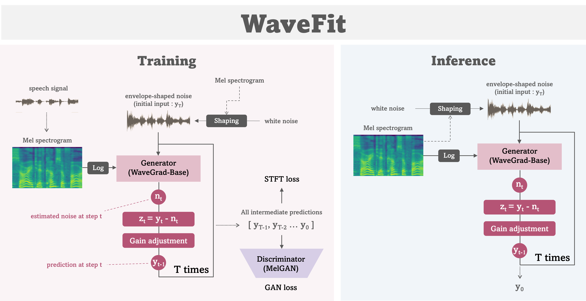

# 💬 WaveFit | A lightweight and fast speech vocoder

This is an unofficial implementation of **`WaveFit`**[1]
which is **a state-of-the-art lightweight/fast speech vocoder** from Google Research.



This repository supports:
- 🔥 Full implementation and training code for the `WaveFit` model
- 🔥 Memory-efficient architecture used in [**Miipher-2**](https://arxiv.org/abs/2505.04457) [3]
- 🔥 Distributed training with multiple GPUs / multiple Nodes

# 📢 UPDATES

- May 18, 2025: 👋 Now supports memory-efficient WaveFit architecture used in [**Miipher-2**](https://arxiv.org/abs/2505.04457) [3]
 
# Requirements

- Python 3.8.10 or later
- PyTorch 2.1 or later

## Building a training environment

To simplify setting up the training environment, I recommend to use container systems like `Docker` or `Singularity` instead of installing dependencies on each GPU machine. Below are the steps for creating `Singularity` containers. 

All example scripts are stored at the [container](container/) folder.

### 1. Install Singularity

Install the latest Singularity by following the official instruction.
- https://docs.sylabs.io/guides/main/user-guide/quick_start.html#quick-installation-steps

### 2. Create a Singularity image file

Create (build) a Singularity image file with a definition file.
```bash
singularity build --fakeroot wavefit.sif wavefit.def
```

** NOTE: You might need to change NVIDIA base image in the definition file to match your GPU machine.

Now, you obtained a container file for training and inference of WaveFit.

## Setting a WandB account for logging

The training code also requires a Weights & Biases account to log the training outputs and demos. 
Please create an account and follow the instruction.

Once you create your WandB account,
you can obtain the API key from https://wandb.ai/authorize after logging in to your account.
And then, the API key can be passed as an environment variable `WANDB_API_KEY` to a training job
for logging training information.

```bash
$ WANDB_API_KEY="12345x6789y..."
```

# Training

## Training from scratch

In this repository, all the training parameters are configured by `Hydra`,
allowing them to be set as command-line arguments.

The following is an example of a job script for training using the LibriTTS dataset.
```bash
ROOT_DIR="/path/to/this/repository/"
DATASET_DIR="/path/to/LibriTTS/"
CONTAINER_PATH="/path/to/wavefit.sif"
TRAIN_DIRS=${DATASET_DIR}/train-clean-100/,${DATASET_DIR}/train-clean-360/
TEST_DIRS=${DATASET_DIR}/test-clean/

WANDB_API_KEY="12345x6789y..."
PORT=12345
JOB_ID="job_name"
OUTPUT_DIR=${ROOT_DIR}/output/${MODEL}/${JOB_ID}/

MODEL="wavefit-3"
# MODEL="wavefit-3_mem-efficient"  #  <- Memory-efficient architecture

BATCH_SIZE=512   # This must be a multiple of GPU number. Please adjust to your environment.
NUM_WORKERS=8

mkdir -p ${OUTPUT_DIR}

# Execution
singularity exec --nv --pwd $ROOT_DIR -B $ROOT_DIR -B $DATASET_DIR \
    --env MASTER_PORT=${PORT} --env WANDB_API_KEY=$WANDB_API_KEY \
    ${CONTAINER_PATH} \
torchrun --nproc_per_node gpu ${ROOT_DIR}/src/train.py \
    model=${MODEL} \
    data.train.dir_list=[${TRAIN_DIRS}] data.test.dir_list=[${TEST_DIRS}] \
    trainer.output_dir=${OUTPUT_DIR} \
    trainer.batch_size=${BATCH_SIZE} \
    trainer.num_workers=${NUM_WORKERS} \
    trainer.logger.project_name=${MODEL} \
    trainer.logger.run_name=job-${JOB_ID}
```
** Please note that the dataset directories are provided as lists.

## Resume training from a checkpoint

While training, checkpoints (state_dict) of models, optimizers and schedulers are saved under the output directory specified in the configuration as follows.
```
output_dir/
├─ ckpt/
│  ├─ latest/
│  │  ├─ opt_d.pth
│  │  ├─ opt_g.pth
│  │  ├─ generator.pth
│  │  ├─ discriminator.pth
│  │  ├─ ...
```

By specifying the checkpoint directory, you can easily resume your training from the checkpoint.
```bash
CKPT_DIR="output_dir/ckpt/latest/"

# Execution
singularity exec --nv --pwd $ROOT_DIR -B $ROOT_DIR -B $DATASET_DIR \
    --env MASTER_PORT=${PORT} --env WANDB_API_KEY=$WANDB_API_KEY \
    ${CONTAINER_PATH} \
torchrun --nproc_per_node gpu ${ROOT_DIR}/src/train.py trainer.ckpt_dir=${CKPT_DIR}
```

### Overrides of parameters

When resuming training, you might want to override some configuration parameters.
To achieve this, in my implementation, only the specified parameters in job scripts will override the configuration from the checkpoint directory.

For example, in the following case, the checkpoint will be loaded from `CKPT_DIR`,
but the training outputs will be saved under `OUTPUT_DIR`.
```bash
CKPT_DIR="output_dir/ckpt/latest/"
OUTPUT_DIR="another/directory/"

# Execution
singularity exec --nv --pwd $ROOT_DIR -B $ROOT_DIR -B $DATASET_DIR \
    --env MASTER_PORT=${PORT} --env WANDB_API_KEY=$WANDB_API_KEY \
    ${CONTAINER_PATH} \
torchrun --nproc_per_node gpu ${ROOT_DIR}/src/train.py \
    trainer.ckpt_dir=${CKPT_DIR} \
    trainer.output_dir=${OUTPUT_DIR}
```

# Inference

Using pre-trained WaveFit models, you can perform inference with audio signals as input
(e.g. for evaluation).

The [`inference.py`](src/inference.py) perform inference for all of audio files in a target directory.
To check other options for the script, please use `-h` option.

```bash
CKPT_DIR="output_dir/ckpt/latest/"
AUDIO_DIR="path/to/target/speech/directory/"

singularity exec --nv --pwd $ROOT_DIR -B $ROOT_DIR -B $AUDIO_DIR \
    --env MASTER_PORT=${PORT} \
    ${CONTAINER_PATH} \
torchrun --nproc_per_node gpu --master_port ${PORT} \
${ROOT_DIR}/src/inference.py \
    --ckpt-dir ${CKPT_DIR} \
    --input-audio-dir ${AUDIO_DIR} \
    --output-dir ${OUTPUT_DIR}
```

# 🤔 Unclear points in the implementation

## 1. Parameter size of generator

WaveFit uses "WaveGrad Base model"[2] as a generator.
But the two paper reported different parameter sizes for the same generator.

- WaveGrad paper -> 15 millions
- WaveFit paper -> 13.8 millions

In order to implement the model as faithfully as possible to the original, I checked the parameter size of the implemented model, but I noticed that there're ambiguities in the architecture even in the WaveGrad paper.
The most unclear part is the Downsample module within the downsampling block (DBlock).

In the paper, it is written that the DBlock is implemented as a convolutional layer with a stride of a downsampling factor.
Naively thinking, to perform only downsampling, using a `kernel_size=3` setting should suffice, and in this case, the parameter size turned out as follows.

- 15.12 millions (kernel_size = 3)

This size is (supposedly) as reported in the WaveGrad paper, and I believe it has been implemented faithfully.
However, personally, I found it unsettling that when the downsampling factor exceeds 3, regions not covered by the convolution arise due to the stride exceeding the kernel size.
Therefore, I recalculated the `kernel_size` as follows, which resulted in a slightly larger parameter size.

- 15.51 millions (kernel_size = down_factor // 2 * 2 + 1)

Regarding the parameter size reported in the WaveFit paper, I was unable to reproduce it, so the details of the implementation remain unclear to me.

## 2. Step condition (positional embedding)

Similar to WaveGrad, the generator loop in WaveFit is conditioned on each step number (eq.15).
However, while WaveGrad, as a diffusion model, is conditioned on continuous coefficients obtained from the noise scheduler, WaveFit has a fixed step number even during training, resulting in discrete conditioning.

Assuming that WaveFit also utilizes Transformer's sinusoidal positional embedding for conditioning, I designed the embedding computation by setting the position coefficients for each step against the total number of steps $T$ as follows:
```python
T = 3
scale = 5000.
pos = torch.linspace(0., scale, T)
# e.g. WaveFit-5 case
# pos = [0., 1250., 2500., 3750., 5000.]
```
The scale value of 5000 was referenced from the WaveGrad paper.

The positional embeddings calculated from these coefficients are fixed vectors, so they can be precomputed.

## 3. Gain adjustment

In WaveFit iteration, the power of estimated signals are adjusted by the gain adjustment function
with a power spectrogram computed from an input mel-spectrogram (Sec.4.1).
In the paper, it is stated that the gain adjustment is calculated using the power of the estimated spectrogram $P_z$ and the input (pseudo) spectrogram $P_c$ according to the following formula.
```math
y_t = (P_c / (P_z + 10^{-8}))z_t
```
However, from my understanding, since the signal amplitude is proportional to the square root of the power ratio, it should actually be implemented as follows. Without this adjustment, the model will not learn correctly.
```math
y_t = \sqrt{(P_c / (P_z + 10^{-8}))}z_t
```

## 4. Optimizer of training

In the WaveFit paper, it states that the same optimizer settings as WaveGrad were used, but I could not find a description of that in the WaveGrad paper. Therefore, I referred to the following paper to configure the learning rate.
- "Noise Level Limited Sub-Modeling for Diffusion Probabilistic Vocoders", Okamoto et al., 2021

Additionally, based on insights into stability in GAN training, I have incorporated the following techniques.
- Gradient clipping
- Learning rate warm-up
- Learning rate decaying

# TODO

- [x] Useful inference scripts

# References

1. "WaveFit: An Iterative and Non-autoregressive Neural Vocoder based on Fixed-Point Iteration", Y. Koizumi et al., IEEE SLT, 2022
1. "WaveGrad: Estimating Gradients for Waveform Generation", N. Chen et al., ICLR, 2021
1. "Miipher-2: A Universal Speech Restoration Model for Million-Hour Scale Data Restoration", S. Karita et al., 2025